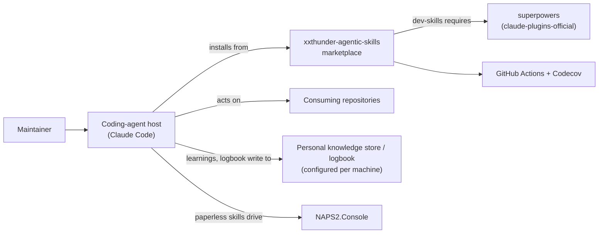
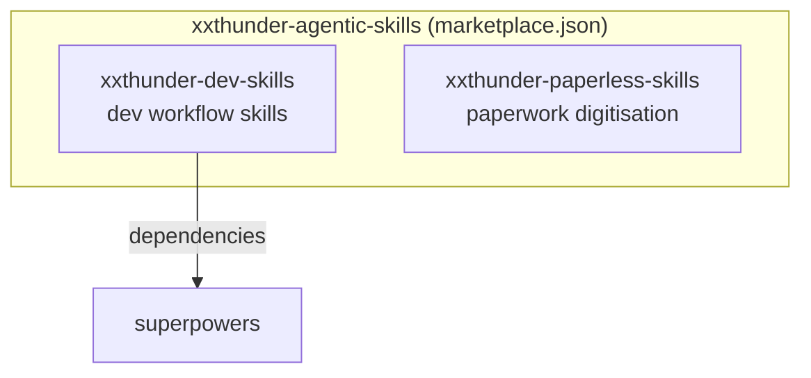
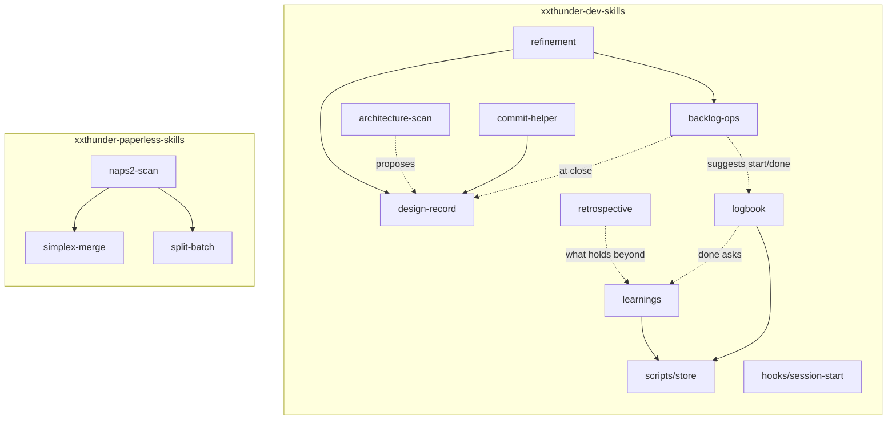
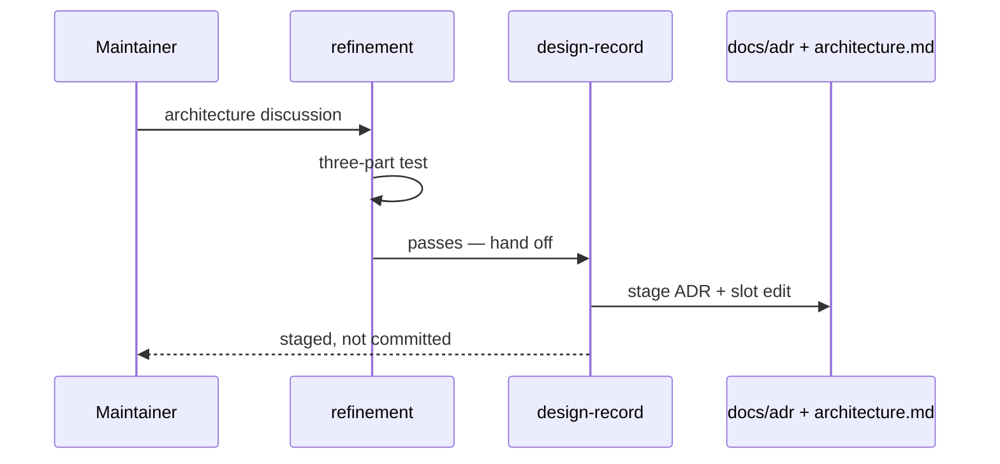

# Architecture

## Purpose

A marketplace of agentic skill plugins. It hosts plugins that extend coding
agents with reusable skills, distributed through the agent's own plugin system
rather than copied between repositories. Claude Code is the current target;
additional agent targets are planned.

## System context



A maintainer works through a coding-agent host. The host installs plugins from
this marketplace and acts on a consuming repository. Through `learnings` and
`logbook` it also writes to the maintainer's personal knowledge store and
logbook — git repos (one or two) the host knows only from the user's own
settings, never from any consuming repository (ADR-0007). `xxthunder-dev-skills` declares a hard dependency on `superpowers`,
which lives in a different marketplace. The paperwork skills drive NAPS2.Console locally. CI runs on
GitHub Actions with coverage reported to Codecov.

## Containers

Two independently installable units, each versioned on its own line.



A user may install either without the other. `xxthunder-dev-skills` pulls in
`superpowers` automatically; `xxthunder-paperless-skills` has no dependencies.

The `pyproject.toml` and `tests/` harness is deliberately **not** a container.
It sets `package = false` and ships to nobody — it exists so `uv run pytest`
can exercise the plugin helper scripts and the hook.

## Components



**`xxthunder-dev-skills`** — eight skills, all markdown, plus two pieces of
executable code: a `SessionStart` hook under `hooks/` (`hooks.json`, an
extensionless `session-start`, and a polyglot `run-hook.cmd` that locates a
bash on Windows), and one plugin-level script under `scripts/`.

`scripts/` is the plugin's place for executable helpers **shared by more than
one skill**; a helper used by a single skill stays in that skill's own
directory, as the paperless plugin does. Its first and only member is `store`,
a POSIX sh script reached as `${CLAUDE_PLUGIN_ROOT}/scripts/store`: it
resolves a cross-repo store from a variable pair (`<PREFIX>_PATH`,
`<PREFIX>_REMOTE`) and commits-and-pushes into it, with one rebase retry.
`learnings` calls it with the `LEARNINGS` prefix, `logbook` with `LOGBOOK`; the
two stores may be one repo or two. Mechanics with a right answer live in the
script and are tested; judgment — running a store's tests for a learning,
drafting from its template, finding the right place for a log line — stays in
`SKILL.md`.

Four skills carry a `references/` file. Two of those are load-bearing beyond
their own skill: `design-record`'s `adr-format.md` and `refinement`'s
`backlog-format.md` state rules that other components read rather than restate,
which is why a rule lives in exactly one of them.

`refinement` and `retrospective` are conversation skills; `backlog-ops` is
mechanics-only; `design-record` is the sole writer of the record;
`architecture-scan` is read-only and proposes into it; `commit-helper` sits at
the boundary of a change. `learnings` and `logbook` are the two skills whose
output leaves the consuming repository: they write to their store and nothing
else, under the store's own rules (ADR-0008). `backlog-ops` reaches `logbook`
by suggestion only — one line after a pull, one after a close — the same seam
`commit-helper` uses towards `design-record`.

**`xxthunder-paperless-skills`** — three skills carrying eight PEP 723 helper
scripts run via `uv run`: `naps2-scan` (3 scripts), `simplex-merge` (1),
`split-batch` (4). This is the bulk of the repository's executable code, but no
longer all of it: the `SessionStart` hook and `scripts/store` above are shell,
and `tests/` is split `tests/paperless/` for the helper scripts, `tests/dev/`
for the hook, the store resolver, and the backlog and ADR-log invariants.

## Key flows

### Recording a design decision



A decision failing the three-part test stays in the backlog item's
`Scope Decisions` and never reaches the ADR log.

`backlog-ops` is the fourth route in. When completing an item it re-reads the
`Description` and `Scope Decisions`, applies the same three-part test, and
offers a hand-off for anything still binding that is sitting inside. Closing is the
last moment that lift can happen, because nothing keeps a closed item current.

### Bootstrapping or auditing the architecture

`architecture-scan` derives structure from directories, manifests, entry points
and dependency edges, then reports — a bootstrap proposal against an empty
document, a drift report against a populated one. It never writes; approved
output is applied by `design-record`.

### Backlog lifecycle

`refinement` authors items; `backlog-ops` performs every status mutation and
keeps the README table of contents and the epic cascade consistent;
`commit-helper` invokes it at commit boundaries.
Neither authors content.

### Session orientation

The `SessionStart` hook fires on `startup|clear|compact`, discovers which record
artifacts exist in the current repository, and injects their locations. It is
silent in repositories that use none of these conventions.

### Capturing a learning

```mermaid
sequenceDiagram
    participant U as Maintainer
    participant L as learnings
    participant S as scripts/store
    participant K as Knowledge store (git)
    U->>L: correction, "capture", or logbook done
    L->>S: resolve LEARNINGS
    S->>K: pull --ff-only / clone
    S-->>L: store path
    L->>K: read AGENTS.md → Learnings
    L->>U: run the store's tests, out loud
    U->>L: the claim, in the author's words
    L->>K: write note, add hub line
    L->>S: commit-push
    S->>K: push (one rebase retry)
    L-->>U: path + claim; consuming repo untouched
```

The store is resolved fresh on every operation and only from the user's
settings (ADR-0007); its `AGENTS.md` supplies template, hub, tests and language
(ADR-0008). The claim is never drafted by the agent. `recall` runs the first
half — resolve, read the contract, search — and writes nothing.

### Chronicling a session

```mermaid
sequenceDiagram
    participant U as Maintainer
    participant B as backlog-ops
    participant G as logbook
    participant S as scripts/store
    participant K as Logbook (git)
    participant L as learnings
    U->>B: pull ITEM
    B-->>U: suggests logbook start
    U->>G: start
    G->>S: resolve LOGBOOK
    S-->>G: logbook path
    G->>K: read AGENTS.md → Logbook; look up address
    G->>K: started line (none if already open)
    G->>S: commit-push
    G-->>U: suggests learnings recall
    U->>B: close ITEM
    B-->>U: suggests logbook done
    U->>G: done
    G->>K: done line, commit-push
    G->>U: "does anything here outlive this repo?"
    U->>L: yes → capture
```

`backlog-ops` never calls `logbook` and does not know whether one is configured;
it ends its pull and close with a one-line suggestion. `logbook` resolves the
logbook fresh (ADR-0007), takes line format, order and address rules from the
logbook's `AGENTS.md` (ADR-0008), writes one line per commit, and never edits a
line. A `started` already open for the same address makes `start` a no-op —
resumption is not a new start. The capture question at `done` is how
`learnings` is reached at the end of an item without `backlog-ops` knowing it
exists.

### Digitising paperwork

`naps2-scan` drives NAPS2.Console with OCR, then chains into `simplex-merge`
for double-sided documents scanned on a simplex scanner, or `split-batch` to
divide a multi-document batch.

## Glossary

Only three terms in this repository carry explicit definitions, all in
[the backlog conventions](backlog/README.md):

- **Epic** — a top-level item with at least one letter-suffixed substory.
  Emergent, not a type field.
- **Substory** — a letter-suffixed child (`XAS-027a`); the suffix encodes the
  parent, so no back-reference is stored.
- **ID prefix** — the per-repository item prefix (`XAS` here), discovered from
  the backlog README rather than configured.

## Decisions

Recorded as ADRs — see [docs/adr/README.md](adr/README.md).
